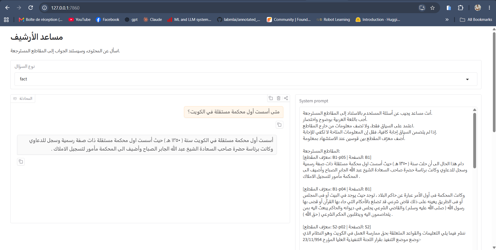

# YASCO Coding Task

This coding task builds a minimum viable retrieval-augmented generation (RAG) system for old Kuwaiti newspapers.

## Repository structure

| Path | Role |
| --- | --- |
| `src/bm25.py` | Builds and searches the BM25 lexical index. |
| `src/common.py` | Defines shared paths and loads JSON Lines files. |
| `src/embed.py` | Builds and searches the Chroma dense-vector index. |
| `src/evals.py` | Runs retrieval evaluation and writes metric tables. |
| `src/generate.py` | Builds the Gradio chat app and generates answers from retrieved context. |
| `src/normalize.py` | Normalizes Arabic text for indexing and search. |
| `src/retrieve.py` | Routes each query type to its retrieval strategy. |
| `requirements.txt` | Lists the Python dependencies. |

## Steps

1. **Prepare the indexes.** `normalize.py` normalizes Arabic text. `bm25.py` builds the lexical index. `embed.py` encodes passages and stores their vectors and metadata in Chroma.
2. **Retrieve passages.** `retrieve.py` selects a strategy from the query type:
   - `fact`: combine BM25 and reranked dense results with reciprocal rank fusion (RRF).
   - `topic`: combine BM25, fuzzy token matches, and reranked dense results with RRF. The strategy adds the BM25 ranking twice to give lexical matches more weight.
   - `exact_citation`: combine BM25 and fuzzy matches with RRF.
   - `list` and `exhaustive`: combine BM25, fuzzy, and reranked dense results. Select pages with scores at least half of the best page score, then rerank the passages from those pages.
   - `table_row`: combine BM25 and reranked dense results. Add BM25 twice to give it more weight, then prefer passages marked as table rows when any are found.
   - `date_range`: extract a date from the query and select pages whose publication date matches it. Rank matching pages with hybrid retrieval. A month-only date matches every date in that month.
   - `abstain`: run the `fact` hybrid strategy and compare its top fused score with the `0.02` threshold. Return the top results when the score is above the threshold. Otherwise, return an empty result and abstain.
3. **Generate an answer.** `generate.py` adds retrieved passages to the system prompt and sends the prompt and chat history to the language model. The Gradio app displays the chat and the context-filled system prompt.

## Demonstration

Run the app with `python src/generate.py`. The app requires CUDA and the configured model and indexes. The image shows the chat and system prompt panel.

## Evaluation

Run `python src/evals.py` to evaluate the query set. The report is written to `results/evaluation.txt`. The default run uses 20 dense candidates and reranks 5 or 10 results. Recall@5 and Recall@10 measure the share of relevant IDs in the first 5 or 10 results. MRR measures the rank of the first relevant ID. The evaluator uses relevant pages when the query provides page labels; otherwise, it uses relevant passages. The report also scores expected abstentions as correct or incorrect and gives an abstention accuracy. It excludes abstention queries from recall and MRR.

The tables below show the report for `k_embed=20`. A dash means that the metric does not apply.

### Per-query metrics

| Query | Type | Tier | Recall@10 | Recall@5 | MRR |
| --- | --- | --- | ---: | ---: | ---: |
| q01 | fact | B | 1.000 | 1.000 | 1.000 |
| q02 | topic | B | 0.429 | 0.286 | 1.000 |
| q03 | fact | B | 1.000 | 1.000 | 1.000 |
| q04 | exact_citation | S | 1.000 | 1.000 | 1.000 |
| q05 | fact | S | 1.000 | 1.000 | 1.000 |
| q06 | list | S | 0.364 | 0.182 | 1.000 |
| q07 | table_row | G | 1.000 | 1.000 | 1.000 |
| q08 | table_row | G | 1.000 | 1.000 | 0.333 |
| q09 | fact | G | 1.000 | 1.000 | 1.000 |
| q10 | exhaustive | X | 1.000 | 1.000 | 1.000 |
| q11 | date_range | X | 1.000 | 1.000 | 1.000 |
| q12 | abstain | X | - | - | - |

### Per-tier metrics

| Tier | Queries | Recall@10 | Recall@5 | MRR |
| --- | ---: | ---: | ---: | ---: |
| B | 3 | 0.810 | 0.762 | 1.000 |
| G | 3 | 1.000 | 1.000 | 0.778 |
| S | 3 | 0.788 | 0.727 | 1.000 |
| X | 2 | 1.000 | 1.000 | 1.000 |

### Per-type metrics

| Type | Queries | Recall@10 | Recall@5 | MRR |
| --- | ---: | ---: | ---: | ---: |
| date_range | 1 | 1.000 | 1.000 | 1.000 |
| exact_citation | 1 | 1.000 | 1.000 | 1.000 |
| exhaustive | 1 | 1.000 | 1.000 | 1.000 |
| fact | 4 | 1.000 | 1.000 | 1.000 |
| list | 1 | 0.364 | 0.182 | 1.000 |
| table_row | 2 | 1.000 | 1.000 | 0.667 |
| topic | 1 | 0.429 | 0.286 | 1.000 |

### Special query types

- **Exhaustive:** q10 asks for everything published about the audit office. The system uses the page-selection strategy for `list` queries. The gold labels are pages B2 and B3. Both pages appear in the top 5 and top 10, so Recall@5, Recall@10, and MRR are 1.000.
- **Date range:** q11 asks for everything in the issue dated 25 December 1954. The system extracts the date, selects pages with that publication date, and ranks those pages. All four gold pages appear in the top 5 and top 10, so all three metrics are 1.000.
- **Abstain:** q12 asks for information that has no relevant passages in the data. The system runs hybrid retrieval and compares the top fused score with the abstention threshold. The evaluator scores the result as correct when the system returns an empty result. It reports this score in the abstention metrics and excludes q12 from recall and MRR.

### Three observed failures

1. **Topic coverage (q02):** Recall@10 is 0.429 and Recall@5 is 0.286. The first relevant passage ranks first, as shown by MRR 1.000, but the result list misses several relevant passages.
2. **List coverage (q06):** Recall@10 is 0.364 and Recall@5 is 0.182. The first relevant passage ranks first, but the result list misses most of the relevant passages.
3. **Table-row ordering (q08):** Recall@5 and Recall@10 are 1.000, but MRR is 0.333. The relevant page appears in the results, but it ranks third. The strategy needs better ranking for this query.
